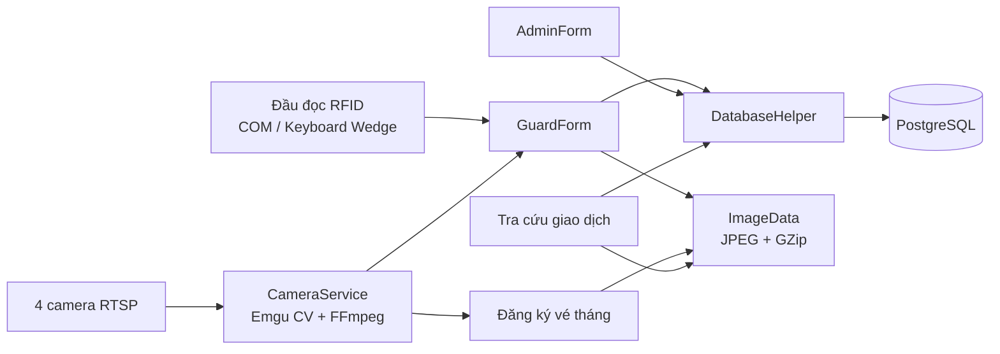

# Smart Parking

Ứng dụng desktop quản lý bãi đỗ xe thông minh trên Windows, kết hợp camera RTSP, thẻ RFID, kiểm soát xe vào/ra, vé tháng, tra cứu lịch sử và quản trị dữ liệu tập trung.

Smart Parking được xây dựng bằng C# và .NET 9 WinForms, sử dụng PostgreSQL làm cơ sở dữ liệu và Emgu CV/OpenCV để nhận luồng hình ảnh từ camera. Hệ thống hướng tới mô hình bãi xe tại trường học, cơ quan hoặc khu nội bộ có nhân viên bảo vệ trực tiếp xác nhận từng lượt xe.

> Dự án hiện hỗ trợ camera thật và chế độ giả lập để phát triển/demo khi chưa có thiết bị. Chức năng nhận dạng biển số tự động (OCR/ANPR) chưa được triển khai; biển số trong chế độ giả lập được nhập thủ công.

## Mục lục

- [Tính năng nổi bật](#tính-năng-nổi-bật)
- [Vai trò người dùng](#vai-trò-người-dùng)
- [Luồng hoạt động](#luồng-hoạt-động)
- [Kiến trúc hệ thống](#kiến-trúc-hệ-thống)
- [Công nghệ sử dụng](#công-nghệ-sử-dụng)
- [Cấu trúc dữ liệu](#cấu-trúc-dữ-liệu)
- [Cấu trúc mã nguồn](#cấu-trúc-mã-nguồn)
- [Yêu cầu hệ thống](#yêu-cầu-hệ-thống)
- [Cài đặt và chạy dự án](#cài-đặt-và-chạy-dự-án)
- [Cấu hình thiết bị](#cấu-hình-thiết-bị)
- [Dữ liệu mặc định](#dữ-liệu-mặc-định)
- [Lưu trữ và dọn dẹp dữ liệu](#lưu-trữ-và-dọn-dẹp-dữ-liệu)
- [Khắc phục sự cố](#khắc-phục-sự-cố)
- [Lưu ý bảo mật và giới hạn hiện tại](#lưu-ý-bảo-mật-và-giới-hạn-hiện-tại)

## Tính năng nổi bật

### Kiểm soát xe vào/ra

- Đọc mã thẻ từ đầu đọc RFID qua cổng COM, mặc định `9600 baud`.
- Hỗ trợ đầu đọc dạng keyboard wedge và nhập mã thẻ giả lập trên giao diện.
- Tự xác định lượt vào hay lượt ra dựa trên trạng thái hiện tại của thẻ trong bãi.
- Chụp hai góc ảnh trước/sau tại làn vào và làn ra.
- Đóng băng khung hình để bảo vệ kiểm tra trước khi xác nhận.
- Đối chiếu ảnh xe lúc vào với ảnh trực tiếp lúc ra.
- Cho phép xác nhận giao dịch hoặc kích hoạt cảnh báo khi thông tin không khớp.
- Tính phí theo loại thẻ; cấu hình mặc định là `5.000 VND` cho vé lượt và `0 VND` cho vé tháng.
- Ghi nhận xe đang ở trong bãi và chuyển giao dịch sang lịch sử khi xe rời bãi.

### Camera và hình ảnh

- Quản lý bốn luồng RTSP độc lập:
  - cổng vào — camera trước;
  - cổng vào — camera sau;
  - cổng ra — camera trước;
  - cổng ra — camera sau.
- Đọc luồng RTSP bằng Emgu CV/OpenCV qua FFmpeg.
- Tự thử kết nối lại camera sau mỗi khoảng thời gian ngắn khi mất luồng.
- Duy trì giao diện bằng khung hình chẩn đoán/giả lập khi camera không khả dụng.
- Lưu ảnh giao dịch và ảnh thành viên dưới dạng JPEG nén GZip (`.bin`) để giảm dung lượng.

### Quản lý vé tháng

- Đăng ký theo nhóm Sinh viên, Giảng viên hoặc Cán bộ.
- Gắn thẻ RFID với mã người dùng, họ tên, ngày sinh, thông tin xe và biển số.
- Chụp ảnh trực tiếp từ một trong bốn camera hoặc chọn ảnh có sẵn từ máy.
- Lưu ảnh chân dung và ảnh phương tiện theo từng biển số.
- Tự sinh mã thành viên theo định dạng `MB000001`, `MB000002`, ...
- Kiểm tra và ngăn một thẻ RFID được gán cho nhiều thành viên vé tháng.

### Tra cứu và quản trị

- Tìm giao dịch theo biển số, mã RFID, mã sinh viên/giáo viên, mã thành viên, thời gian vào hoặc thời gian ra.
- Lọc theo vé tháng/vé lượt và trạng thái trong bãi/đã ra.
- Hỗ trợ phân trang và lựa chọn độ chính xác thời gian đến ngày, giờ, phút hoặc giây.
- Hiển thị thông tin thành viên cùng ảnh trước/sau của giao dịch được chọn.
- Admin có thể tìm kiếm, thêm, sửa và xóa dữ liệu của bảy nhóm bảng nghiệp vụ.
- Quản lý thời hạn lưu lịch sử và dọn dữ liệu cũ trực tiếp từ giao diện.
- Có bộ xử lý ngoại lệ toàn cục và thông báo lỗi thân thiện cho các lỗi database, camera và RFID thường gặp.

## Vai trò người dùng

| Vai trò | Chức năng chính |
| --- | --- |
| **Admin** | Cấu hình bốn camera RTSP; quản lý tài khoản, loại thẻ, thẻ RFID, thành viên, xe trong bãi, lịch sử và thiết lập; cấu hình thời hạn lưu trữ; dọn dữ liệu cũ. |
| **Guard** | Theo dõi camera; kết nối đầu đọc RFID; tiếp nhận và xác nhận xe vào/ra; đối chiếu hình ảnh; cảnh báo sai lệch; đăng ký vé tháng; tra cứu giao dịch; dùng chế độ giả lập thiết bị. |

## Luồng hoạt động

### Xe vào

1. Bảo vệ quẹt thẻ RFID hoặc nhập mã thẻ giả lập.
2. Hệ thống kiểm tra thẻ đã có trong bảng `active_parking` hay chưa.
3. Nếu chưa có, hệ thống đóng băng hai camera làn vào và chụp ảnh trước/sau.
4. Thông tin vé tháng được hiển thị nếu thẻ đã liên kết với thành viên.
5. Bảo vệ xác nhận lượt vào; ảnh nén được lưu vào ổ đĩa và giao dịch được ghi vào `active_parking`.

### Xe ra

1. Bảo vệ quẹt lại thẻ đang có trong bãi.
2. Hệ thống tải ảnh lúc vào, đồng thời chụp hai ảnh hiện tại tại làn ra.
3. Bảo vệ đối chiếu hình ảnh và thông tin thành viên/biển số.
4. Nếu hợp lệ, phí được lấy từ loại thẻ và bảo vệ xác nhận cho xe ra.
5. Hệ thống ghi giao dịch vào phân vùng tháng của `parking_history`, sau đó xóa bản ghi khỏi `active_parking` trong cùng một transaction.
6. Nếu không khớp, bảo vệ có thể hủy thao tác và bật trạng thái cảnh báo.

Phím thao tác nhanh trên màn hình bảo vệ:

- `Enter`: hoàn tất mã từ đầu đọc keyboard wedge hoặc xác nhận xe ra đang chờ duyệt.
- `Esc`: kích hoạt cảnh báo/hủy lượt ra đang chờ đối chiếu.

## Kiến trúc hệ thống



Ứng dụng theo mô hình WinForms nguyên khối:

- lớp giao diện xử lý nghiệp vụ tương tác;
- `DatabaseHelper` phụ trách kết nối, khởi tạo schema, truy vấn và transaction;
- `CameraService` quản lý bốn luồng camera nền và snapshot;
- `RFIDReader` chuẩn hóa dữ liệu thiết bị;
- `FileStorageManager` nén, giải nén, tổ chức và dọn ảnh;
- `ExceptionManager` tập trung xử lý và trình bày lỗi.

## Công nghệ sử dụng

| Thành phần | Công nghệ |
| --- | --- |
| Ngôn ngữ | C# |
| Giao diện | Windows Forms |
| Runtime | .NET 9 (`net9.0-windows`) |
| Cơ sở dữ liệu | PostgreSQL |
| PostgreSQL driver | Npgsql 10.0.3 |
| Camera/video | Emgu CV 4.9, OpenCV runtime cho Windows, FFmpeg backend |
| RFID | `System.IO.Ports` 10.0.9 |
| Lưu ảnh | `System.Drawing`, JPEG chất lượng 75 và GZip |
| Package khác trong dự án | Microsoft.Data.Sqlite 10.0.9 |

## Cấu trúc dữ liệu

Khi mở màn hình đăng nhập lần đầu, ứng dụng tự kết nối PostgreSQL, tạo database nếu chưa tồn tại, tạo schema và seed dữ liệu mẫu.

| Bảng | Mục đích |
| --- | --- |
| `users` | Tài khoản đăng nhập và vai trò `Admin`/`Guard`. |
| `card_types` | Danh mục loại thẻ và phí mặc định. |
| `rfid_cards` | Mã thẻ, loại thẻ, trạng thái, ngày đăng ký và ngày hết hạn. |
| `subscription_users` | Hồ sơ thành viên vé tháng, thông tin xe và đường dẫn ảnh. |
| `active_parking` | Các xe hiện đang ở trong bãi. Mỗi thẻ chỉ có tối đa một lượt hoạt động. |
| `parking_history` | Giao dịch đã hoàn tất, được phân vùng theo tháng dựa trên `exit_time`. |
| `settings` | Cấu hình camera RTSP và thời hạn lưu lịch sử theo dạng key-value. |

Quan hệ dữ liệu chính:

```text
card_types 1 ─── n rfid_cards 1 ─── 0..1 subscription_users
                         │
                         ├──── 0..1 active_parking
                         └──── n parking_history
```

`parking_history` tự tạo phân vùng cho tháng hiện tại và tháng kế tiếp. Trước khi ghi giao dịch, hệ thống tiếp tục bảo đảm phân vùng tương ứng đã tồn tại.

## Cấu trúc mã nguồn

```text
smart-parking/
├── Program.cs                          # Điểm vào, bootstrap thư mục và xử lý lỗi toàn cục
├── LoginForm.cs                        # Đăng nhập và điều hướng theo vai trò
├── AdminForm.cs                        # Cấu hình camera, CRUD dữ liệu, retention
├── GuardForm.cs                        # Màn hình vận hành và luồng xe vào/ra
├── SearchVehicleForm.cs                # Tra cứu, lọc, phân trang và xem ảnh
├── SubscriptionRegistrationForm.cs     # Đăng ký thành viên vé tháng
├── CameraService.cs                    # Bốn luồng RTSP, snapshot và fallback giả lập
├── RFIDReader.cs                       # Đọc RFID qua SerialPort
├── DatabaseHelper.cs                   # Schema, seed, truy vấn và transaction PostgreSQL
├── FileStorageManager.cs               # Nén/giải nén và dọn file ảnh
├── ExceptionManager.cs                 # Xử lý lỗi tập trung
├── *.Designer.cs / *.resx              # Thiết kế và tài nguyên WinForms
├── SmartParking.csproj                 # Cấu hình dự án và NuGet packages
└── README.md
```

Khi chạy, ứng dụng tạo thêm cấu trúc lưu ảnh bên cạnh file thực thi:

```text
ImageData/
├── Transactions/
│   ├── Vao/
│   └── Ra/
└── Subscriptions/
    └── <BIEN_SO>/
        ├── portrait.bin
        └── vehicle.bin
```

## Yêu cầu hệ thống

### Bắt buộc

- Windows 10/11 x64.
- [.NET 9 SDK](https://dotnet.microsoft.com/download/dotnet/9.0).
- PostgreSQL Server đang hoạt động.
- Tài khoản PostgreSQL có quyền kết nối và tạo bảng. Nếu muốn ứng dụng tự tạo database, tài khoản cần thêm quyền `CREATEDB`.

### Khuyến nghị cho phát triển

- Visual Studio 2022 có workload **.NET desktop development**, hoặc IDE hỗ trợ .NET tương đương.
- Git để tải và quản lý mã nguồn.

### Thiết bị tùy chọn

- Tối đa bốn camera IP hỗ trợ RTSP, cấu trúc URL tương thích thiết bị đang sử dụng.
- Đầu đọc RFID xuất chuỗi chữ/số qua cổng COM hoặc hoạt động như bàn phím.

Không có camera hoặc đầu đọc RFID vẫn có thể chạy dự án bằng chế độ giả lập trên màn hình Guard.

## Cài đặt và chạy dự án

### 1. Lấy mã nguồn

```powershell
git clone <URL_REPOSITORY>
cd smart-parking
```

Nếu bạn đã có mã nguồn, chỉ cần mở terminal tại thư mục chứa `SmartParking.csproj`.

### 2. Chuẩn bị PostgreSQL

Khởi động PostgreSQL và chuẩn bị một tài khoản phù hợp. Có hai cách:

- cấp quyền `CREATEDB` để ứng dụng tự tạo database `smart_parking`; hoặc
- tự tạo trước database rồi cấp quyền tạo/đọc/ghi bảng cho tài khoản ứng dụng.

Ví dụ tạo database thủ công trong `psql`:

```sql
CREATE DATABASE smart_parking;
```

Không cần chạy file migration riêng; ứng dụng tự tạo các bảng, sequence, phân vùng và dữ liệu ban đầu.

### 3. Tạo file cấu hình `.env`

Tạo file `.env` tại thư mục gốc dự án:

```env
SQL_HOST=localhost
SQL_PORT=5432
SQL_USER=postgres
SQL_PASSWORD=your_strong_password
SQL_DATABASE=smart_parking
```

Ứng dụng tìm `.env` tại thư mục file thực thi, thư mục làm việc hiện tại và đường dẫn dự án tương ứng khi chạy ở chế độ phát triển. File này đã được đưa vào `.gitignore`; không commit mật khẩu thật lên repository.

### 4. Restore và build

```powershell
dotnet restore
dotnet build
```

### 5. Chạy ứng dụng

```powershell
dotnet run --project SmartParking.csproj
```

Hoặc mở `SmartParking.csproj` bằng Visual Studio và nhấn `F5`.

Ở lần chạy đầu tiên, màn hình Login sẽ khởi tạo cơ sở dữ liệu. Sau khi đăng nhập:

- dùng tài khoản Admin để cập nhật URL camera và dữ liệu nền;
- dùng tài khoản Guard để vận hành bãi xe hoặc thử chế độ giả lập.

### Đóng gói ứng dụng

Ví dụ publish bản Windows x64 phụ thuộc runtime:

```powershell
dotnet publish SmartParking.csproj -c Release -r win-x64 --self-contained false
```

Sau khi publish, đặt file `.env` cạnh file thực thi hoặc bảo đảm thư mục làm việc chứa `.env`. Thư mục `ImageData` sẽ được tạo tại vị trí file thực thi, vì vậy tài khoản chạy ứng dụng cần quyền ghi tại đó.

## Cấu hình thiết bị

### Camera RTSP

1. Đăng nhập bằng Admin.
2. Mở **Cấu Hình Camera**.
3. Nhập IP, cổng, tài khoản và mật khẩu cho cả bốn camera.
4. Lưu cấu hình để ứng dụng tạo URL RTSP và ghi vào bảng `settings`.
5. Đăng xuất rồi mở màn hình Guard để các luồng camera tải cấu hình mới.

Cấu hình seed sử dụng mẫu URL của Hikvision/HiLook với các channel `101`, `102`, `201`, `202`. Đây chỉ là giá trị minh họa; cần thay toàn bộ IP và thông tin đăng nhập trước khi dùng camera thật.

Khi kết nối thất bại, `CameraService` hiển thị khung chẩn đoán giả lập và tiếp tục thử lại thay vì dừng toàn bộ ứng dụng.

### Đầu đọc RFID

Trên màn hình Guard:

1. Chọn cổng COM trong danh sách.
2. Nhấn **Kết nối**.
3. Quẹt thẻ; dữ liệu được lọc để chỉ giữ ký tự chữ và số.

Thông số serial hiện tại là `9600 baud`, `8 data bits`, `1 stop bit`, không parity và không handshake.

Nếu đầu đọc hoạt động như bàn phím, giữ cửa sổ Guard ở trạng thái nhận phím và quẹt thẻ kết thúc bằng `Enter`. Mã thẻ keyboard wedge cần tối thiểu bốn ký tự.

### Chạy giả lập

Màn hình Guard cho phép:

- nhập mã thẻ và giả lập quẹt;
- đặt biển số hiển thị trên khung camera giả lập;
- giả lập xe ra có biển số không khớp;
- bật/tắt âm thanh thông báo.

Các mã thẻ mẫu ở phần dưới có thể dùng để kiểm thử nhanh.

## Dữ liệu mặc định

### Tài khoản

| Vai trò | Tên đăng nhập | Mật khẩu |
| --- | --- | --- |
| Admin | `admin` | `admin123` |
| Guard | `guard` | `guard123` |

### Loại thẻ

| Mã | Loại thẻ | Phí mặc định |
| --- | --- | ---: |
| `1` | Vé tháng (Sinh viên) | 0 VND |
| `2` | Vé tháng (Giảng viên) | 0 VND |
| `3` | Vé tháng (Cán bộ) | 0 VND |
| `4` | Vé lượt | 5.000 VND |

Hệ thống cũng seed năm thẻ kiểm thử (`11111111` đến `55555555`) và ba hồ sơ thành viên mẫu cho ba loại vé tháng. Dữ liệu seed chỉ được thêm khi các bảng tương ứng đang trống.

> Hãy đổi ngay mật khẩu mặc định và thay cấu hình camera mẫu nếu triển khai ngoài môi trường học tập/demo.

## Lưu trữ và dọn dẹp dữ liệu

- Ảnh giao dịch được chuyển sang JPEG chất lượng 75, nén GZip và lưu dưới phần mở rộng `.bin`.
- Ảnh vé tháng nằm trong `ImageData/Subscriptions/<BIEN_SO>`.
- Ảnh lượt vào/ra nằm trong `ImageData/Transactions/Vao` và `ImageData/Transactions/Ra`.
- Cơ sở dữ liệu chỉ lưu đường dẫn tương đối; cặp ảnh trước/sau được ghép bằng dấu `;` trong trường đường dẫn giao dịch.
- Thiết lập `HistoryRetentionMonths` mặc định là `3` tháng, có thể đặt từ 1 đến 120 tháng trong màn hình Admin.
- Khi Admin chọn dọn dẹp, ứng dụng xóa phân vùng lịch sử và các file giao dịch cũ hơn thời hạn cấu hình.
- Ảnh hồ sơ vé tháng không thuộc quy trình dọn lịch sử giao dịch.
- Bootstrapper có thể chuyển ảnh thành viên từ cấu trúc thư mục cũ `Subscriptions/Students`, `Staff`, `Lecturers` sang cấu trúc `ImageData` mới khi tìm thấy dữ liệu liên kết.

Nên sao lưu đồng thời PostgreSQL và toàn bộ thư mục `ImageData`; chỉ sao lưu một trong hai sẽ làm lịch sử mất dữ liệu hoặc mất ảnh đối chiếu.

## Khắc phục sự cố

### Không kết nối được PostgreSQL

- Kiểm tra dịch vụ PostgreSQL đã chạy chưa.
- Kiểm tra năm biến `SQL_*` trong `.env`.
- Xác nhận cổng mặc định `5432` không bị chặn.
- Nếu lỗi xảy ra lúc tạo database, cấp quyền `CREATEDB` hoặc tạo `smart_parking` thủ công.
- Xác nhận người dùng có quyền tạo bảng, sequence và bảng phân vùng.

### Camera chỉ hiển thị màn hình giả lập

- Thay IP/tài khoản/mật khẩu mẫu trong màn hình Admin.
- Thử URL RTSP bằng phần mềm hỗ trợ RTSP để xác nhận camera có phát luồng.
- Kiểm tra channel, cổng `554`, firewall và kết nối mạng đến camera.
- Khởi động lại màn hình Guard sau khi lưu cấu hình để tải URL mới.

### Không thấy cổng COM hoặc không đọc được thẻ

- Cắm lại thiết bị và mở danh sách COM để tải lại.
- Kiểm tra driver của đầu đọc và bảo đảm cổng không bị ứng dụng khác chiếm dụng.
- Xác nhận thiết bị dùng thông số serial tương thích với cấu hình hiện tại.
- Nếu thiết bị là keyboard wedge, không cần kết nối COM; đưa focus về màn hình Guard rồi quẹt thẻ.

### Có dữ liệu nhưng không hiển thị ảnh

- Kiểm tra thư mục `ImageData` có nằm cạnh file thực thi đã tạo dữ liệu hay không.
- Không di chuyển riêng database hoặc riêng file ảnh sang máy khác.
- Bảo đảm tài khoản Windows có quyền đọc/ghi thư mục ứng dụng.

## Lưu ý bảo mật và giới hạn hiện tại

- Mật khẩu tài khoản ứng dụng đang được lưu dạng văn bản thuần trong bảng `users`; cần bổ sung băm mật khẩu trước khi triển khai thực tế.
- Thông tin đăng nhập camera được lưu trong bảng `settings` và nằm trực tiếp trong URL RTSP.
- Chuỗi kết nối có giá trị mặc định trong mã nguồn; nên luôn cung cấp `.env` với mật khẩu mạnh.
- Trạng thái và ngày hết hạn của thẻ có trong schema, nhưng luồng quẹt thẻ hiện chưa chặn đầy đủ theo hai trường này.
- Ứng dụng chưa điều khiển barie vật lý; thông báo “mở barie” hiện biểu diễn quyết định nghiệp vụ trên giao diện.
- Chưa có nhận dạng biển số tự động, nhận dạng khuôn mặt, thanh toán điện tử hoặc đồng bộ cloud.
- Dự án chưa có bộ test tự động; cần kiểm thử tích hợp với PostgreSQL và thiết bị thật trước khi vận hành.
- Package `Microsoft.Data.Sqlite` có trong project nhưng luồng dữ liệu hiện tại sử dụng PostgreSQL.

## Định hướng phát triển

- Tích hợp OCR/ANPR để tự động đọc và so khớp biển số.
- Băm mật khẩu, phân quyền chi tiết và ghi nhật ký thao tác người dùng.
- Kiểm tra trạng thái/hạn sử dụng thẻ ngay tại cổng.
- Điều khiển barie, cảm biến vòng từ và tín hiệu cảnh báo thực tế.
- Thêm báo cáo doanh thu, thống kê công suất bãi và xuất dữ liệu.
- Bổ sung backup/restore, test tự động và pipeline CI/CD.
- Tách cấu hình nhạy cảm khỏi database hoặc mã hóa thông tin camera.

---

Smart Parking là dự án học tập và mô phỏng nghiệp vụ bãi xe thông minh. Trước khi sử dụng trong môi trường thực tế, hãy hoàn thiện các yêu cầu về bảo mật, an toàn thiết bị, sao lưu và kiểm thử vận hành.
